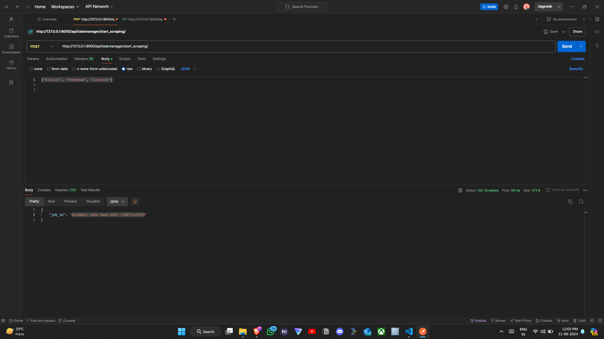
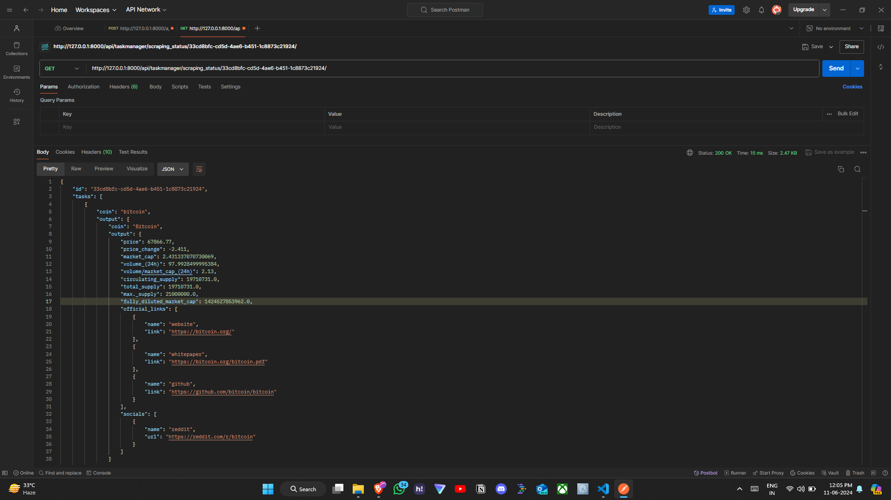
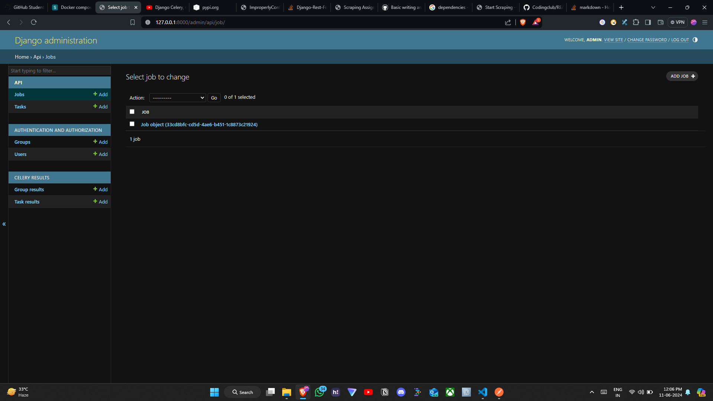
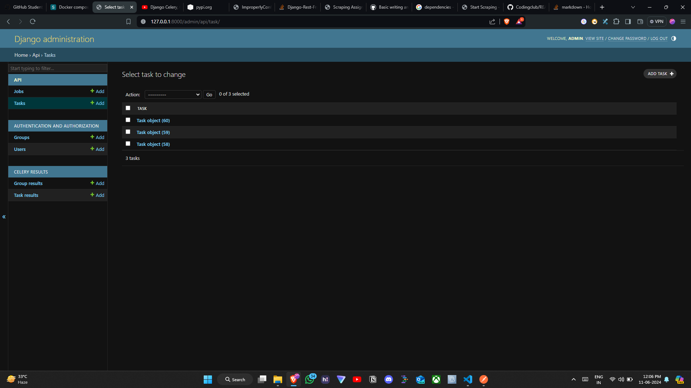
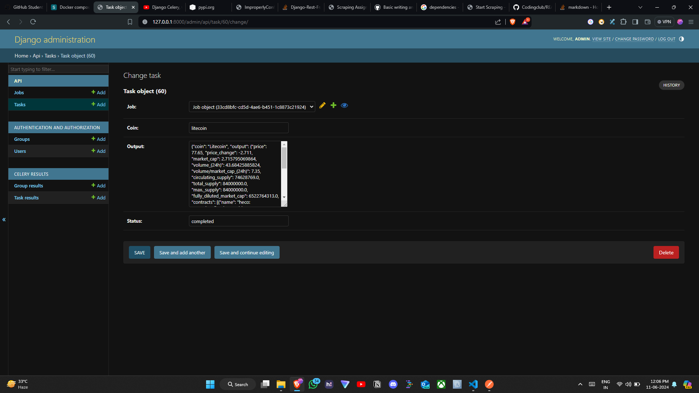

## I have created an django api that extract data from the website and show json response 
**dependencies**
    - djangorestframework
    - celery
    - requests
    - selenium

# The screenshots of the Project 

## Payload Screenshot


## Response Screenshot


## Jobs Screenshot


## Task Screenshot


## Bitcoin response django admin panel Screenshot


## Litecoin response django admin panel Screenshot


## Ethereum response django admin panel Screenshot


## How to run
### Make sure that you are in root dir
```
pip install -r requirements.txt
python manage.py makemigrations
python manage.py migrate
python manage.py runserver
```


## url pattern
1.`http://127.0.0.1:8000/api/taskmanager/start_scraping/` this url pattern is use to get the job id, the payload will be like this `["bitcoin", "ethereum", "litecoin"]`.
2. `http://127.0.0.1:8000/api/taskmanager/scraping_status/<uuid:job_id>/` this url pattern is for the json response of the currency. the response will be like this 
## Response     
```
    {
    "id": "33cd8bfc-cd5d-4ae6-b451-1c8873c21924",
    "tasks": [
        {
            "coin": "bitcoin",
            "output": {
                "coin": "Bitcoin",
                "output": {
                    "price": 67866.77,
                    "price_change": -2.411,
                    "market_cap": 2.431337070730069,
                    "volume_(24h)": 97.9928499995384,
                    "volume/market_cap_(24h)": 2.13,
                    "circulating_supply": 19710731.0,
                    "total_supply": 19710731.0,
                    "max._supply": 21000000.0,
                    "fully_diluted_market_cap": 1424527853962.0,
                    "official_links": [
                        {
                            "name": "website",
                            "link": "https://bitcoin.org/"
                        },
                        {
                            "name": "whitepaper",
                            "link": "https://bitcoin.org/bitcoin.pdf"
                        },
                        {
                            "name": "github",
                            "link": "https://github.com/bitcoin/bitcoin"
                        }
                    ],
                    "socials": [
                        {
                            "name": "reddit",
                            "url": "https://reddit.com/r/bitcoin"
                        }
                    ]
                }
            },
            "status": "completed"
        },
        {
            "coin": "ethereum",
            "output": {
                "coin": "Ethereum",
                "output": {
                    "price": 3558.99,
                    "price_change": -3.371,
                    "market_cap": 3.34427756179877,
                    "volume_(24h)": 84.3414694794184,
                    "volume/market_cap_(24h)": 3.44,
                    "circulating_supply": 120155670.0,
                    "total_supply": 120155670.0,
                    "fully_diluted_market_cap": 427756179877.0,
                    "contracts": [
                        {
                            "name": "bnb smart chain (bep20): \n0x2170...f933f8",
                            "address": "0x2170ed0880ac9a755fd29b2688956bd959f933f8"
                        }
                    ],
                    "official_links": [
                        {
                            "name": "whitepaper",
                            "link": "https://github.com/ethereum/wiki/wiki/White-Paper"
                        },
                        {
                            "name": "github",
                            "link": "https://github.com/ethereum/go-ethereum"
                        }
                    ],
                    "socials": [
                        {
                            "name": "𝕏\ntwitter",
                            "url": "https://twitter.com/ethereum"
                        },
                        {
                            "name": "reddit",
                            "url": "https://reddit.com/r/ethereum"
                        },
                        {
                            "name": "chat",
                            "url": "https://gitter.im/orgs/ethereum/rooms"
                        }
                    ]
                }
            },
            "status": "completed"
        },
        {
            "coin": "litecoin",
            "output": {
                "coin": "Litecoin",
                "output": {
                    "price": 77.65,
                    "price_change": -2.711,
                    "market_cap": 2.715795069864,
                    "volume_(24h)": 43.68425885824,
                    "volume/market_cap_(24h)": 7.35,
                    "circulating_supply": 74628769.0,
                    "total_supply": 84000000.0,
                    "max._supply": 84000000.0,
                    "fully_diluted_market_cap": 6522764313.0,
                    "contracts": [
                        {
                            "name": "heco: \n0xecb5...fb63b4",
                            "address": "0xecb56cf772b5c9a6907fb7d32387da2fcbfb63b4"
                        }
                    ],
                    "official_links": [
                        {
                            "name": "website",
                            "link": "https://litecoin.org/"
                        },
                        {
                            "name": "github",
                            "link": "https://github.com/litecoin-project/litecoin"
                        }
                    ],
                    "socials": [
                        {
                            "name": "𝕏\ntwitter",
                            "url": "https://twitter.com/litecoin"
                        },
                        {
                            "name": "reddit",
                            "url": "https://reddit.com/r/litecoin"
                        },
                        {
                            "name": "chat",
                            "url": "https://telegram.me/litecoin"
                        }
                    ]
                }
            },
            "status": "completed"
        }
    ]
}
```

